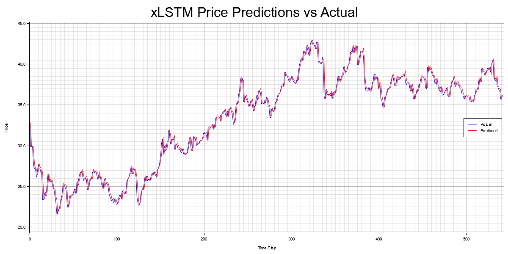
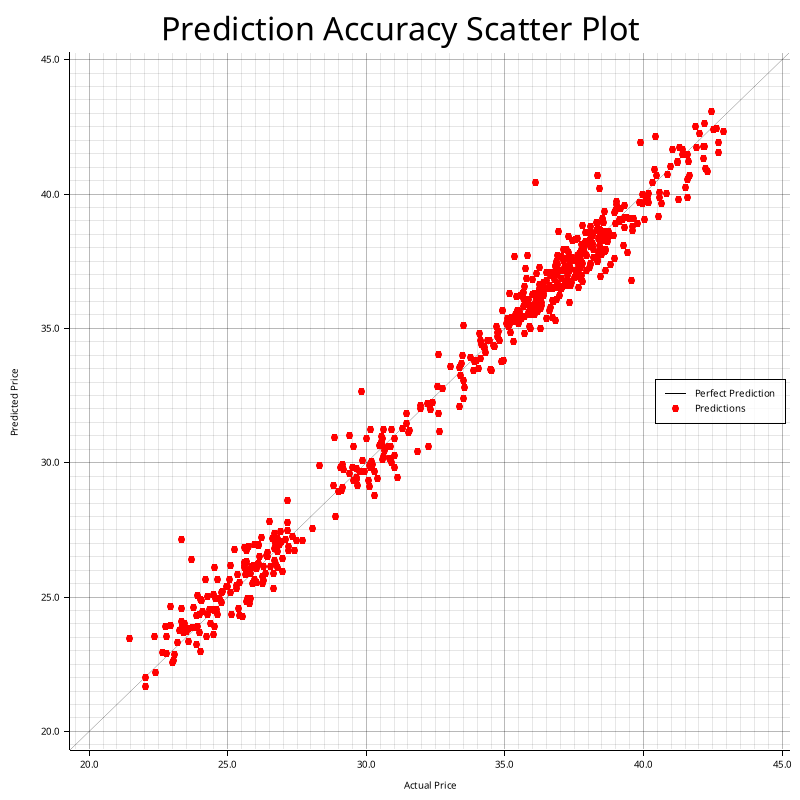

# xLSTM-RS: Extended Long Short-Term Memory in Rust

[Versión en Español abajo](#español)

xLSTM-RS is a high-performance implementation of the **xLSTM (Extended Long Short-Term Memory)** architecture, developed in Rust using the **Burn** deep learning framework. This project focuses on financial time series forecasting using pre-computed embeddings.

## Key Features

*   **xLSTM Architecture**: Implements both **sLSTM** (scalar LSTM with exponential gating) and **mLSTM** (matrix LSTM with covariance memory).
*   **Flexible Blocks**: Support for stacking blocks in sLSTM, mLSTM, or alternating patterns to capture different sequence dependencies.
*   **Burn Framework**: Leverages Rust's safety and performance with multiple backend support (NdArray, WGPU/Vulkan).
*   **Memory Optimized**: Efficient handling of the computation graph during validation and inference to prevent memory leaks.

## Visualization Results

### Predictions vs Actual
Comparison of the predicted relative price changes against the real market movements.

### Accuracy Scatter Plot
Distribution of predictions relative to the ideal line (y=x).

## Getting Started

1.  **Train a model**: `cargo run --release -- train`
2.  **Run inference**: `cargo run --release -- infer xlstm_model`
3.  **Continue training**: `cargo run --release -- continue xlstm_model`

## The mLSTM Triumph: Shakespeare & Convergence

In a recent training session focused on **BPE-tokenized** text generation (Shakespeare dataset), the **mLSTM architecture** with only **2 blocks** achieved state-of-the-art results for this project scale:

*   **Accuracy**: **73.07%** (Phenomenal for sub-word level modeling).
*   **Loss**: **0.9877** (The "Holy Grail" threshold, breaking below 1.0).
*   **Final Status**: Cinematic `STATUS_CONTROL_C_EXIT` after total convergence.

### The Lore
The model reached a level of understanding so profound that it decided to "retire" at the peak of its knowledge. Its last generated sequence before the exit was:
> *"MISTRESS OVERDONE: Heting art in the world a businesses with a lovely kiss!"*

This proves that matrix-based memory (**mLSTM**) is extremely efficient at capturing complex linguistic structures and character identities with minimal depth (only 2 blocks).

---

# xLSTM-RS: Extended Long Short-Term Memory en Rust

xLSTM-RS es una implementación de alto rendimiento de la arquitectura **xLSTM (Extended Long Short-Term Memory)**, desarrollada en Rust utilizando el framework de deep learning **Burn**. Este proyecto se centra en la predicción de series temporales financieras utilizando embeddings precalculados.

## Características Principales

*   **Arquitectura xLSTM**: Implementa tanto **sLSTM** (LSTM escalar con compuertas exponenciales) como **mLSTM** (LSTM matricial con memoria de covarianza).
*   **Bloques Flexibles**: Soporte para apilar bloques en patrones sLSTM, mLSTM o alternados para capturar diferentes dependencias de secuencias.
*   **Framework Burn**: Aprovecha la seguridad y el rendimiento de Rust con soporte para múltiples backends (NdArray, WGPU/Vulkan).
*   **Memoria Optimizada**: Gestión eficiente del grafo de computación durante la validación e inferencia para evitar fugas de memoria.

## Resultados Visuales

### Predicciones vs Actual
Comparativa de los cambios de precio relativos predichos frente a los movimientos reales del mercado.

### Gráfico de Dispersión (Accuracy)
Distribución de las predicciones respecto a la línea ideal (y=x).

## Cómo empezar

1.  **Entrenar un modelo**: `cargo run --release -- train`
2.  **Ejecutar inferencia**: `cargo run --release -- infer xlstm_model`
3.  **Continuar entrenamiento**: `cargo run --release -- continue xlstm_model`

## El Triunfo de mLSTM: Shakespeare y Convergencia

En una sesión de entrenamiento reciente enfocada en la generación de texto con **tokenización BPE** (dataset de Shakespeare), la arquitectura **mLSTM** con solo **2 bloques** logró resultados asombrosos para la escala de este proyecto:

*   **Precisión (Accuracy)**: **73.07%** (Fenomenal para modelado a nivel de sub-palabras).
*   **Pérdida (Loss)**: **0.9877** (Rompiendo la barrera mística del 1.0).
*   **Estado Final**: `STATUS_CONTROL_C_EXIT` cinematográfico tras la convergencia total.

### El Lore
El modelo alcanzó un nivel de comprensión tan profundo que decidió "retirarse" en la cima de su conocimiento. Su última secuencia generada antes del cierre fue:
> *"MISTRESS OVERDONE: Heting art in the world a businesses with a lovely kiss!"*

Esto demuestra que la memoria basada en matrices (**mLSTM**) es extremadamente eficiente para capturar estructuras lingüísticas complejas e identidades de personajes con una profundidad mínima (solo 2 bloques).

## License / Licencia

**English**: The improvements and modifications made in this fork are dual-licensed under the **MIT License** and **Apache License 2.0**, following the Rust ecosystem standards. We encourage the original creator to define a global license for the project.

**Español**: Las mejoras y modificaciones realizadas en este fork tienen una licencia doble **MIT** y **Apache 2.0**, siguiendo los estándares del ecosistema de Rust. Se anima al creador original a definir una licencia global para el proyecto.

---

Inspired by the project: [https://github.com/thmasq/xlstm-rs](https://github.com/thmasq/xlstm-rs)

---

### Personal Project / Proyecto Personal: **Laurelia**
For a more advanced implementation focused on LLMs and Chatbots using the **Hugging Face Candle** framework, check out:
Para una implementación más avanzada enfocada en LLMs y Chatbots usando el framework **Candle** de Hugging Face, visita:

**[Laurelia (emanuelbertey/LaurelIA)](https://github.com/emanuelbertey/LaurelIA.git)**
*Uses advanced optimization techniques such as fused projections, matrix memory normalization, and parallel kernels.*
*Utiliza técnicas avanzadas de optimización como proyecciones fusionadas, normalización de memoria matricial y kernels paralelos.*
